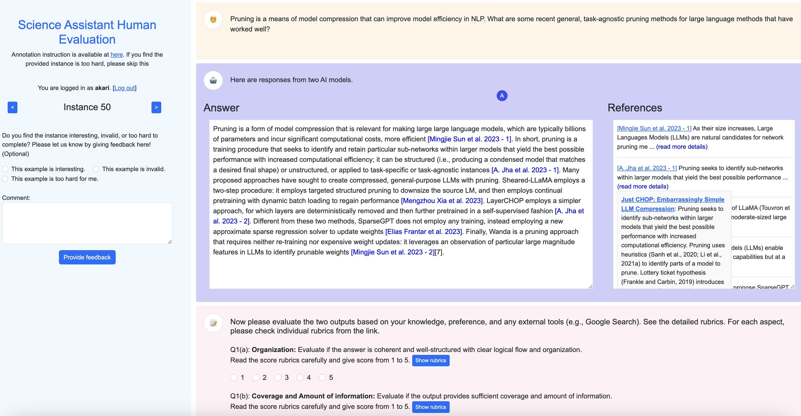

# Human Evaluation Annotation Interface for OpenScholar

This folder contains the code for the human eval annotation interface used in the paper [OpenScholar: Synthesizing Scientific Literature with Retrieval-augmented LMs](https://allenai.org/blog/openscholar).

**Acknowledgement:** The code is based on [allenai/open-instruct](https://github.com/allenai/open-instruct/tree/main/human_eval), with modifications to support (1) RAG evaluations and (2) add fine-grained evaluations. Thanks the Tulu authors!

## Installation

```bash
conda create -n human_eval python=3.10
conda activate human_eval
pip install -r requirements.txt
```

## Running the Interface locally

### Preparing data
Before running the app, you need to put evaluation instance in the `data` folder. Each instance should have a prompt and two completions with citations from two different models. We provide an example in `data/human_eval_sample.jsonl`.

Each line of this file should be in the following format:

```json
{
    "prompt": "prompt text",
    "completions": [
        {
            "model": "model 1 name",
            "completion": "completion text",
            "refs_list" : [{"title": "title", "id": "ref_id", "url": "url_to_ref", "text": "ref_text"}]
        },
        {
            "model": "model 2 name",
            "completion": "completion text",
            "refs_list" : [{"title": "title", "id": "ref_id", "url": "url_to_ref", "text": "ref_text"}]
        }
    ]
}
```

We provide a script to format the answer file in an expected way. Note that to get the corresponding paper URL information, you have to set your semantic scholar API key (`SS_API_KEY`) from [Semantic Scholar API](https://www.semanticscholar.org/product/api).

```
python convert_output_files.py \
    --file_a FILE_A \
    --file_b FILE_B \
    --model_a MODEL_A_NAME \
    --model_b MODEL_B_NAME \
    --output_fn OUTPUT_FILE_NAME \
    --prefix TASK_PREFIX
```

Now you can run the app with:

```bash
python app.py --comparison_data_path OUTPUT_FILE_NAME
```

You can open the app in your browser at http://localhost:5001. When doing the annotation, you can track the progress at the following url: http://localhost:5001/summary.

Here is a screenshot of the annotation interface:

<p align="center" width="100%">
      
</p>

## Share your annotation interface
To share the annotation interface with others, you can host the app on virtual machine (VM) using cloud services like Google Cloud. If you use Google Cloud as I did,

1. [Create a VM (Compute Engine Instance)](https://cloud.google.com/compute/docs/instances/create-start-instance)
2. [Configure firewall rules](https://cloud.google.com/filestore/docs/configuring-firewall) to open `5001` (e.g., [a related discussion](https://stackoverflow.com/questions/21065922/how-to-open-a-specific-port-such-as-9090-in-google-compute-engine))
3. You can access to the app via `http://YOUR_VM_EXTERNAL_IP:5001`


## Post-processing and Analysis

The annotation results are saved in a database file `data/evaluation.db` by default. You can use the following command to export the results to an excel file:

```bash
python export_db.py
```

Then, you can use the following command to compute the evaluation metrics and agreements:

```bash
python compute_metrics.py
```

## Citation

If you used this code, please cite our paper as well as the original Tulu paper that this app interface code is based on:

```bibtex
@article{openscholar,
  title={{OpenScholar}: Synthesizing Scientific Literature with Retrieval-Augmented Language Models},
  author={Asai, Akari and He*, Jacqueline and Shao*, Rulin and Shi, Weijia and Singh, Amanpreet and Chang, Joseph Chee  and Lo,  Kyle and Soldaini, Luca and Feldman, Tian, Sergey and Mike, D’arcy and Wadden, David and Latzke, Matt and Minyang and Ji, Pan and Liu, Shengyan and Tong, Hao and Wu, Bohao and Xiong, Yanyu and Zettlemoyer, Luke and Weld, Dan and Neubig, Graham and Downey, Doug and Yih, Wen-tau and Koh, Pang Wei and Hajishirzi, Hannaneh},
  journal={Arxiv},
  year={2024},
}

@misc{wang2023far,
   title={How Far Can Camels Go? Exploring the State of Instruction Tuning on Open Resources},
   author={Yizhong Wang and Hamish Ivison and Pradeep Dasigi and Jack Hessel and Tushar Khot and Khyathi Raghavi Chandu and David Wadden and Kelsey MacMillan and Noah A. Smith and Iz Beltagy and Hannaneh Hajishirzi},
   year={2023},
   eprint={2306.04751},
   archivePrefix={arXiv},
   primaryClass={cs.CL}
}
```
